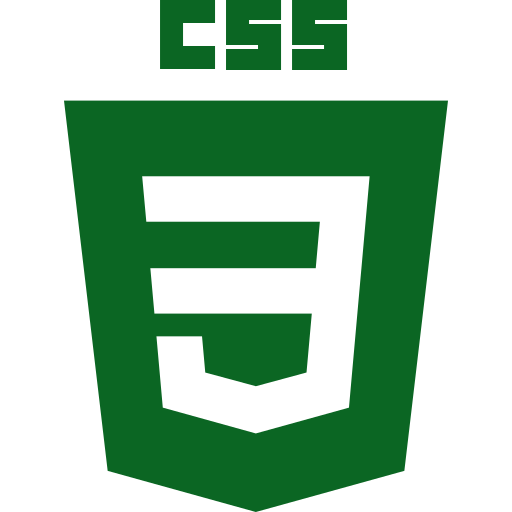

My name's Sara and I am very glad you stumbled upon my page. Here you will find projects that reveal my passions: reading, writing and (of course) programming. I'm getting ahead of myself, aren't I? Let me introduce myself

### Get to know me
```yaml
  located_in: Cluj, Romania
  education:
    [
      "Student in Computer Science",
    ]
  fields_of_interest:
    [
      "Signal Processing",
      "Digital System Design",
      "Embedded Computing",
      "Web Development",
    ]
  technical_background:
    [
      "Intern - Web Development - Java",
    ]
```

### Languages and technologies that I have used
<div align="center">
  
  
  
  
  
  
  
  
  
  
  
</div>

### How you can get in touch with me
[](mailto:molnar.sara.viviana@gmail.com)
[](https://www.linkedin.com/in/sara-viviana-molnar/)
[](https://mlnrsara.netlify.app)


